## This is the link the Microsoft store: 
https://teams.microsoft.com/l/app/65b266fb-1d9a-4b96-8e0c-9ccd2ea847cf

# Smart-Check-up:

Smart telemedicine platform, based on IoT devices that provide Vital signs and historical values. This to transform the way telemedicine is provided and solve the biggest problem in relation to distance check-ups, which is taking biometrics.
Our current version consists of an Oxygen Saturation Thimble, an ECG sensor and a contactless Thermometer that can send real time information to a Teams application. This allowing distance consultations and follow ups to become more seamless and to grab a real biometrics and vital signs while doing them. 

- [Smart-Check-up:](#smart-check-up)
      - [Of course, if you are a judge from Microsoft's Team apps Development Challenge from Devpost we are always open to do a LIVE TEST DEMO (naturally through Teams) of the product, just contact us through Devpost.](#of-course-if-you-are-a-judge-from-microsofts-team-apps-development-challenge-from-devpost-we-are-always-open-to-do-a-live-test-demo-naturally-through-teams-of-the-product-just-contact-us-through-devpost)
- [To Test the platform:](#to-test-the-platform)
  - [Test Monitor Tab:](#test-monitor-tab)
    - [Test IoT Devices:](#test-iot-devices)
    - [Test Summary SubTab:](#test-summary-subtab)
    - [Test Report SubTab:](#test-report-subtab)
    - [Test Additional Notes SubTab:](#test-additional-notes-subtab)
    - [Test Past Reports SubTab:](#test-past-reports-subtab)
    - [Test ECG Details SubTab:](#test-ecg-details-subtab)
    - [Test Eng/SI Button:](#test-engsi-button)
  - [Test Historical Tab:](#test-historical-tab)
- [Video Demo:](#video-demo)

#### Of course, if you are a judge from Microsoft's Team apps Development Challenge from Devpost we are always open to do a LIVE TEST DEMO (naturally through Teams) of the product, just contact us through Devpost.

# To Test the platform:

## Test Monitor Tab:

### Test IoT Devices:

The application is divided into two sections, the monitor section and the history section.

In order to test the monitor, please enter the following link:

https://scup.blankit.com.mx/tabs

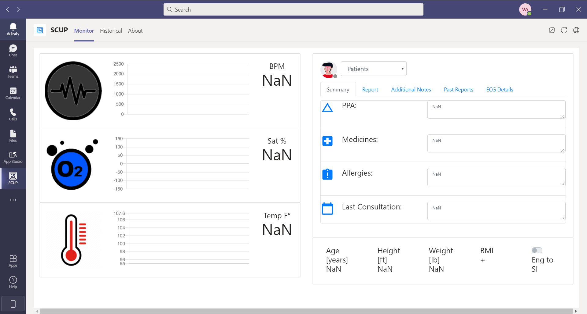

Because the application requires having the sensors in place, we created a simulator which allows us to simulate the three sensors on a real patient.

https://scup.blankit.com.mx/test

In order to use the simulator we will have to select a patient from the drop-down list and activate the sensor we want as shown in the gif.

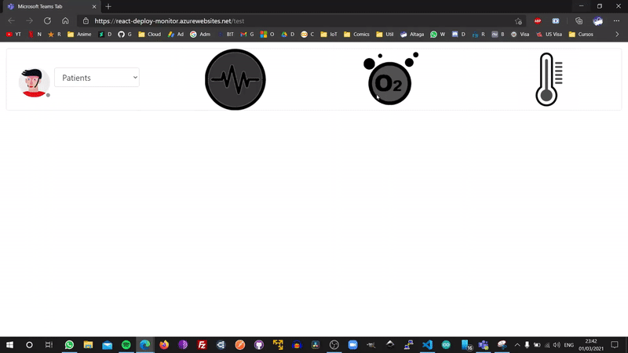

Once this is done, we can see the data on the platform begin to appear when we select the patient we are simulating, for this example it will be Victor Altamirano.

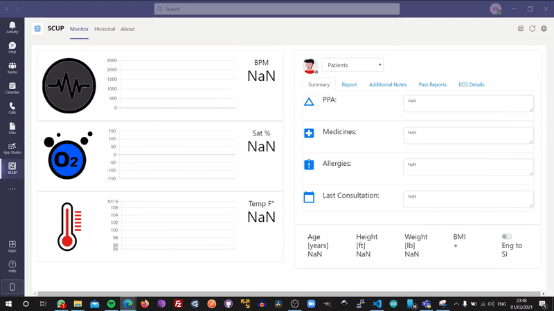

Since we have been able to simulate the data from the sensors in real time, we can go on to review each of the characteristics of the website.

### Test Summary SubTab:

When selecting a patient we will be able to see their data in summary, this data can be edited by the doctor at any time. Try also to change some data and when updating the web page the changes will be maintained.

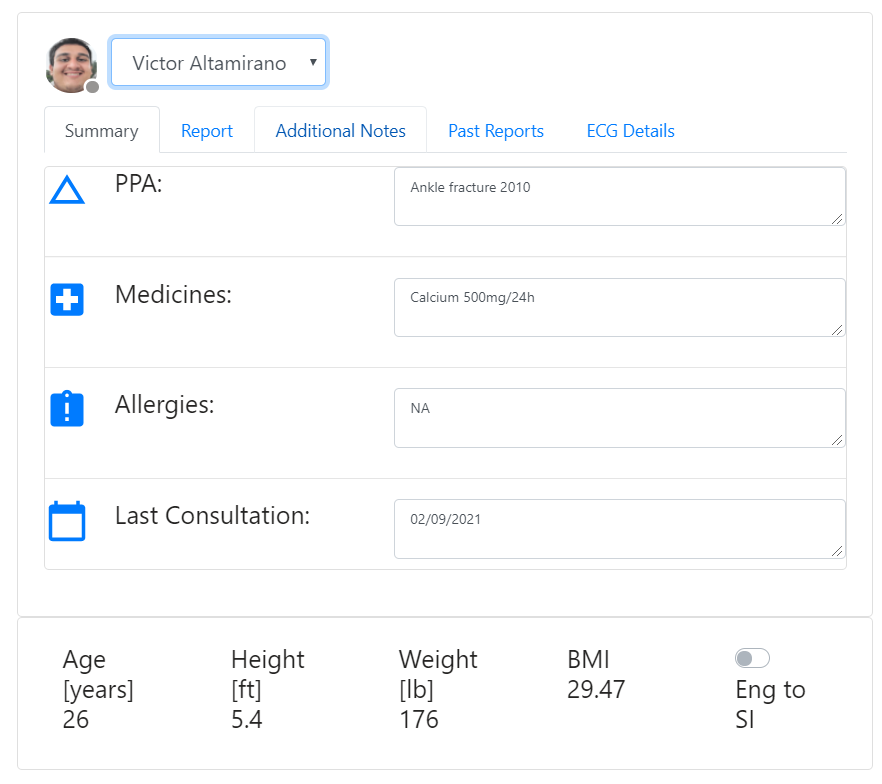

### Test Report SubTab:

The report data, which is based on the SOAP format, are written during the query. When you finish writing them, as you press the submit button, it will be uploaded to our database for later removal.

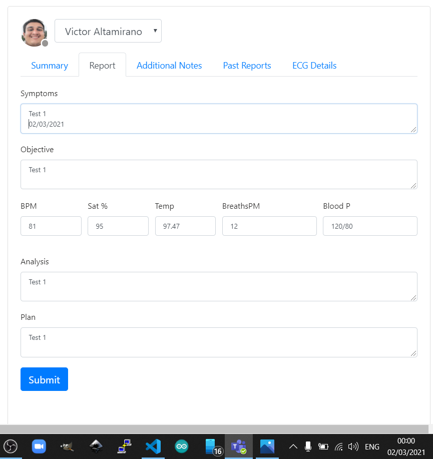

Once the data has been correctly sent to the database, an alert will appear that the data has been uploaded correctly.

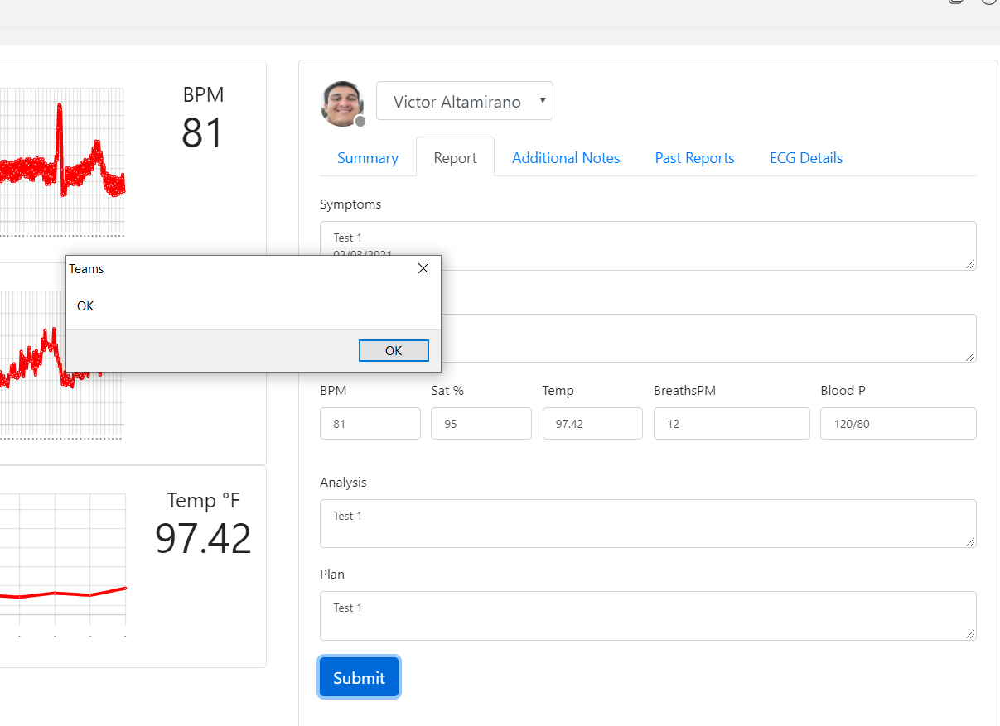

NOTE: Take a good look at the data and date of the report that in the PastReports tab we will show how this report has been saved.

### Test Additional Notes SubTab:

If the doctor sees fit, he can add additional notes to this format in order to better suit your needs.

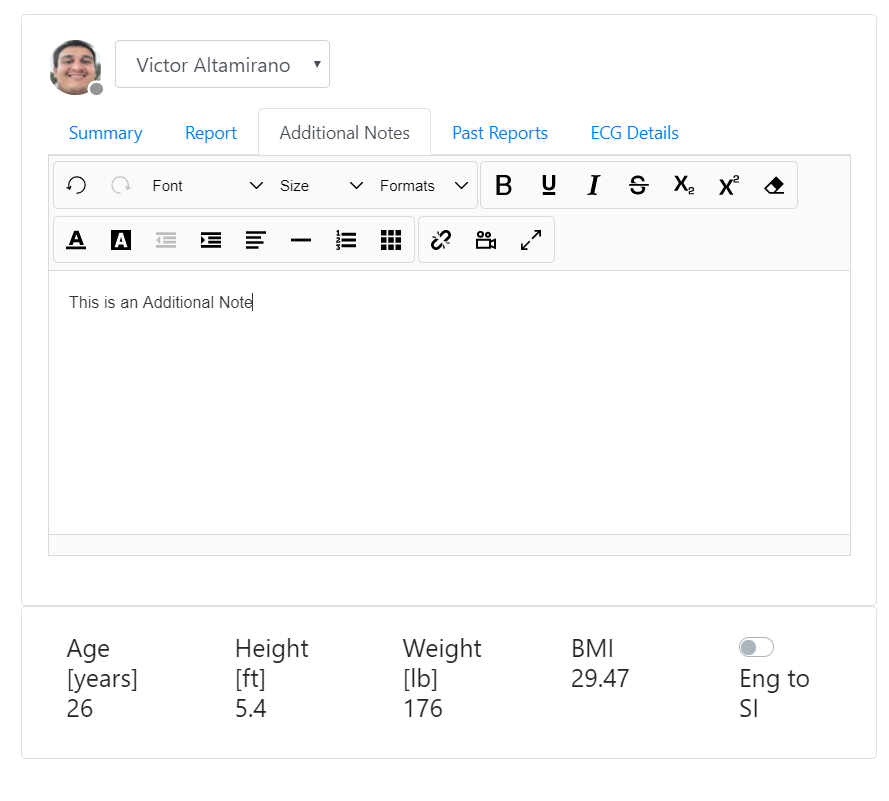

### Test Past Reports SubTab:

When we select a patient from the drop-down list, the data from their past reports is uploaded to the page, so even if we have not uploaded a patient report, the past reports will be available.

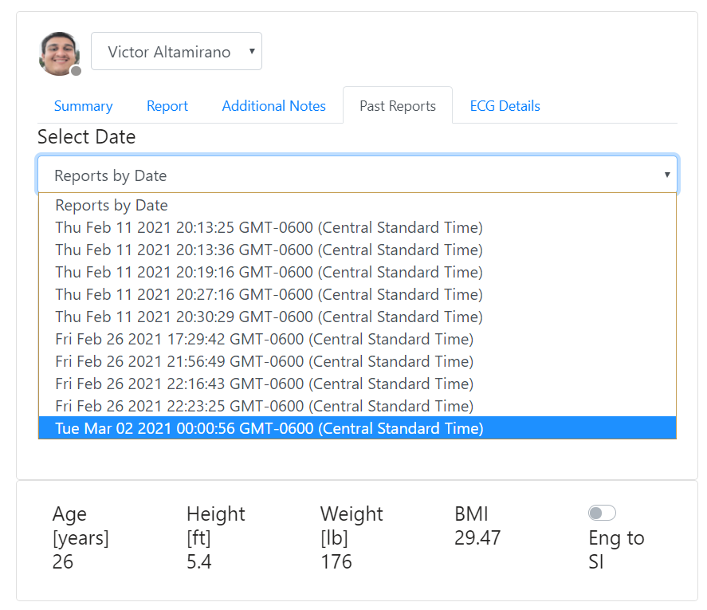

In this case, when selecting the last report, we can see that it is the last report that we show in [Test Report SubTab] (# test-report-subtab)

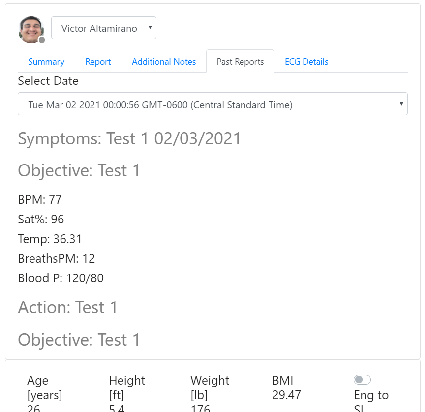

### Test ECG Details SubTab:

This tab is necessary to simulate the ECG sensor in the simulator mentioned in [Test IoT Devices](# test-iot-devices) because we require the platform to have at least 10 - 20 seconds of ECG information to be able to perform its analysis.
To perform the analysis we will have to wait for the button in the image to change from gray...

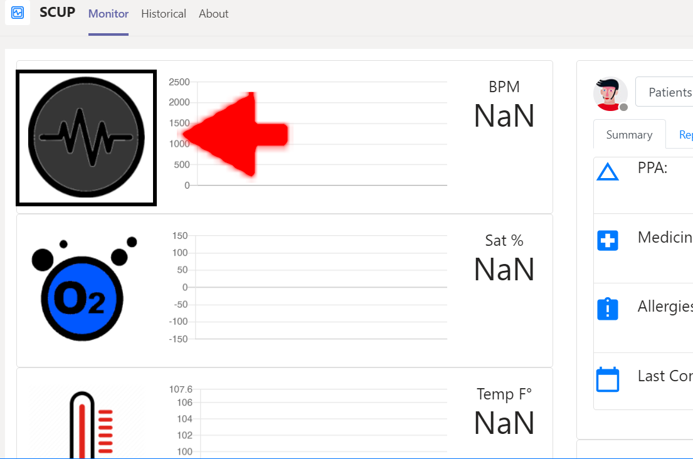

To red.

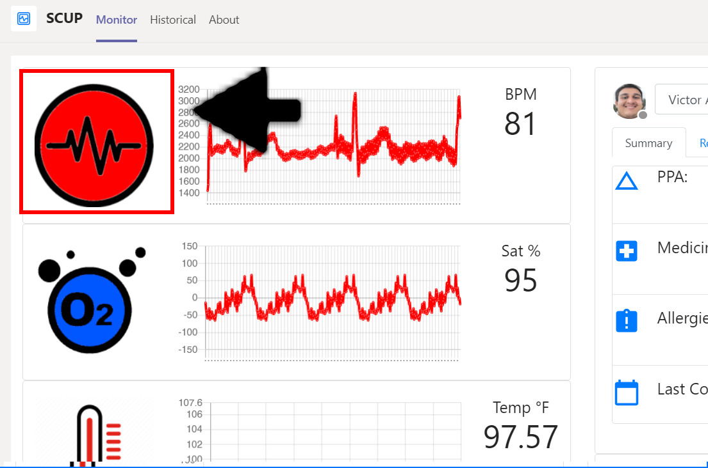

Once it is ready, we will press the button and wait for the analysis to be completed correctly. This may take a few seconds, you can continue working on the platform while the notification comes out.

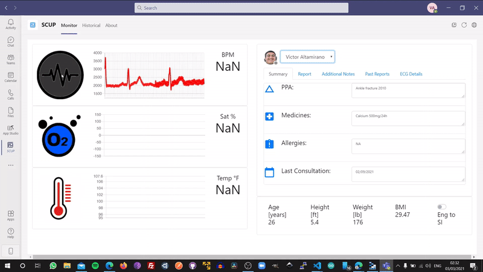

### Test Eng/SI Button:

Because we want this application to be an application for international use, we placed a button to change from the English system to the international measurement system, to view the Height, Weight and Temperature data in their corresponding formats.

It is worth mentioning that this was one of the characteristics most appreciated by the test subjects in our Alpha.

| Eng System       | Int System    |
| ---------------- | ------------- |
| Fahrenheit [°F]  | Celsius [°C]  |
| Feet [ft]        | Meter [m]     |
| Pound [lb]       | Kilogram [kg] |

Example:

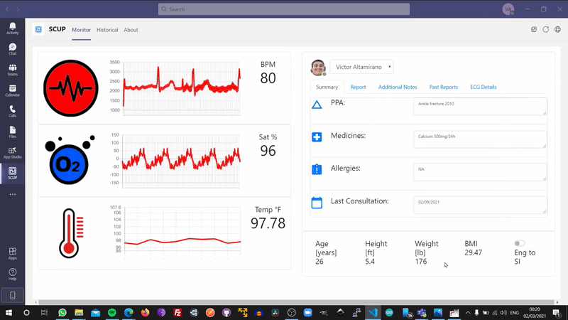

## Test Historical Tab:

To test this tab it is necessary to enter the following link.

https://scup.blankit.com.mx/history

In this case, for this tab, the only thing we will have to do is select the patient we want to observe their data and start browsing the calendar.

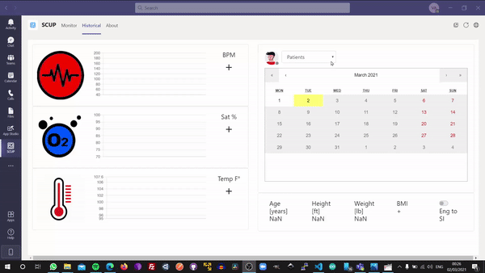

# Video Demo:

Video: Click on the image
[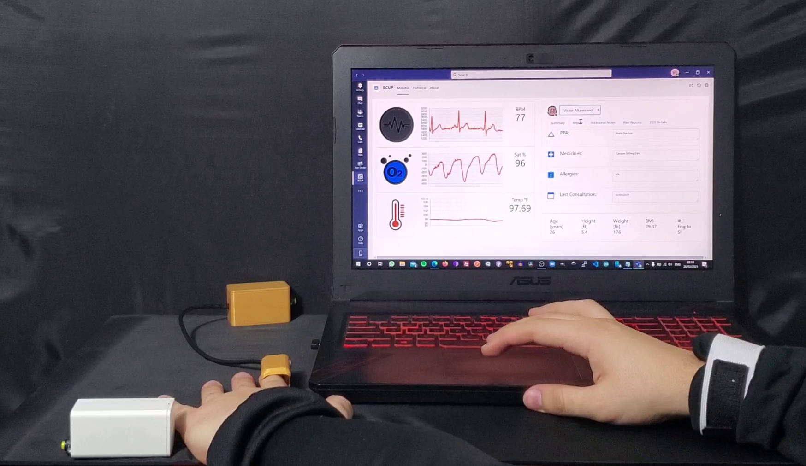](https://youtu.be/ncT_ejb2VKo)
