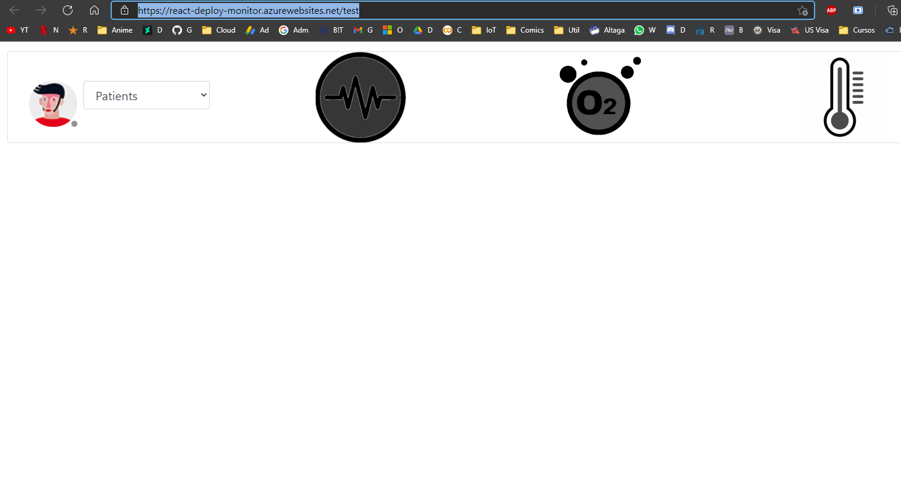

# Smart-Check-up:

Smart telemedicine platform, based on IoT devices that provide Vital signs and historical values. This to transform the way telemedicine is provided and solve the biggest problem in relation to distance check-ups, which is taking biometrics.
Our current version consists of an Oxygen Saturation Thimble, an ECG sensor and a contactless Thermometer that can send real time information to a Teams application. This allowing distance consultations and follow ups to become more seamless and to grab a real biometrics and vital signs while doing them. 

- [Smart-Check-up:](#smart-check-up)
- [Test the platform:](#test-the-platform)
  - [Test Monitor Tab:](#test-monitor-tab)
    - [Test IoT Devices:](#test-iot-devices)
    - [Test Summary SubTab:](#test-summary-subtab)
    - [Test Report SubTab:](#test-report-subtab)
    - [Test Additional Notes SubTab:](#test-additional-notes-subtab)
    - [Test Past Reports SubTab:](#test-past-reports-subtab)
    - [Test ECG Details SubTab:](#test-ecg-details-subtab)
    - [Test Eng/SI Button:](#test-engsi-button)
  - [Test Historical Tab:](#test-historical-tab)
- [Video Demo:](#video-demo)

# Test the platform:

## Test Monitor Tab:

### Test IoT Devices:

La aplicacion esta dividida en 2 secciones, la seccion de monitor y la seccion de historial.

para poder testear el monitor, porfavor entrar al siguiente enlace.

https://react-deploy-monitor.azurewebsites.net/tabs

Debido a que la aplicacion requiere tener los sensores colocados, creamos un simulador el cual permite simular los 3 sensores sobre un paciente real.

https://react-deploy-monitor.azurewebsites.net/test

Para poder usar el simulador tendremos que seleccionar un paciente de la lista desplegable y activar el sensor que deseemos como se muestra en el gif.

Una vez hecho esto, podremos ver los datos en la plataforma empezar a aparecer al seleccionar el paciente que estamos simulando, para este ejemplo sera Victor Altamirano.

Ya que hemos podido simular los datos de los sensores en tiempo real, podemos pasar a revisar cada una de las caracteristicas de la pagina web.

### Test Summary SubTab:

Al seleccionar un paciente podremos ver sus datos en summary, estos datos pueden ser editados por el medico en cualquier momento, pruebe cambiar algun dato y al actualizar la pagina web los cambios se mantendran.

### Test Report SubTab:

Los datos de reporte, los cuales estan basados en el formato SOAP son escritos durante la consulta, y al terminar de escribirlos al apretar el boton de submit este se subira a nuestra base de datos para su posterior deslpiegue.

Una vez el dato haya sido enviado correctamente a la base de datos saldra una alerta que el dato ha sido subido correctamente.

NOTA: Mire bien los datos y fecha del reporte que en la pestaña de PastReports mostraremos como este reporte de ha guardado.

### Test Additional Notes SubTab:

Si el medico lo cree conveniente, este puede agregar notas adicionales a este formato con tal de adecuarse mas a sus necesidades.

### Test Past Reports SubTab:

Cuando seleccionamos un paciente de la lista desplegable, los datos de sus reportes pasados son cargados a la pagina, asi que aun si no hemos subido reporte del paciente, estaran disponibles los reportes pasados. 

En este caso al seleccionar el ultimo reporte, podemos ver que es el ultimo reporte que mostramos en [Test Report SubTab](#test-report-subtab)

### Test ECG Details SubTab:

Esta pestaña para ser probada es necesario que simulemos en sensor de ECG en el simulador mencionado en [Test IoT Devices](#test-iot-devices) debido a que requerimos que la plataforma tenga almenos 10 - 20 segundos de informacion de ECG para poder realizar el analisis de el mismo.

Para Realizar el analisis tendremos que esperar que el boton en la imagen, cambie de gris.

A color rojo.

Una vez que este listo presionaremos el boton y esperaremos a que el analisis se complete correctamente, esto puede tomar algunos segundos, puede seguir trabajando en la plataforma mientras sale la notificacion.

### Test Eng/SI Button:

Debido a que buscamos que esta aplicacion sea una aplicacion se uso internacional, colocamos un boton para cambiar de sistema ingles a sistema internacional de medida, para visualizar los datos de Altura, Peso y Temperatura en sus formatos correspondientes.

Cabe mencionar que esta fue una de las caracteristicas mas apreciadas por los sujetos de prueba en nuestro Alpha.

| Eng System       | Int System    |
| ---------------- | ------------- |
| Fahrenheit [°F]  | Celsius [°C]  |
| Feet [ft]        | Meter [m]     |
| Pound [lb]       | Kilogram [kg] |

Ejemplo:

## Test Historical Tab:

Para probar esta tab es necesario que entre al siguiente enlace.

https://react-deploy-monitor.azurewebsites.net/history

En este caso para esta tab lo unico que tendremos que hacer sera seleccionar al paciente que queremos observar sus datos y empezar a navegar en el calendario.

# Video Demo:

Video: Click on the image

